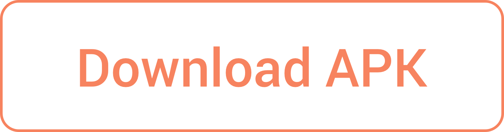
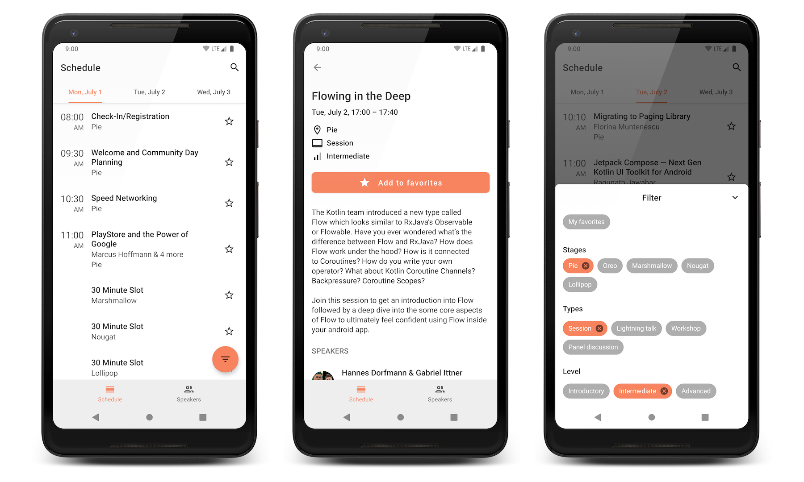

## droidcon Berlin 2019 (unofficial app)

This is an _unofficial_ app for [droidcon Berlin 2019](https://de.droidcon.com).

#### Features
- Check out the conference schedule
- Look up information about the speakers
- Store your favorite talks
- Get notifications when a talk is about to start
- And of course: dark mode 😎

#### Note
Because there is no official API, the information in the app might become outdated if there are changes to the schedule. Still, I hope you find it useful.

#### Come say hi!
I’m attending the conference with my colleagues from [Freeletics](https://freeletics.com) – come say hi, chat about cool Android stuff, and be sure to watch [their talk on Coroutines Flow](https://www.de.droidcon.com/speaker/Hannes-Dorfmann-%26-Gabriel-Ittner).

---

Yes, the code is bad. I built the app in a couple of nights. I’ll do better next year.
